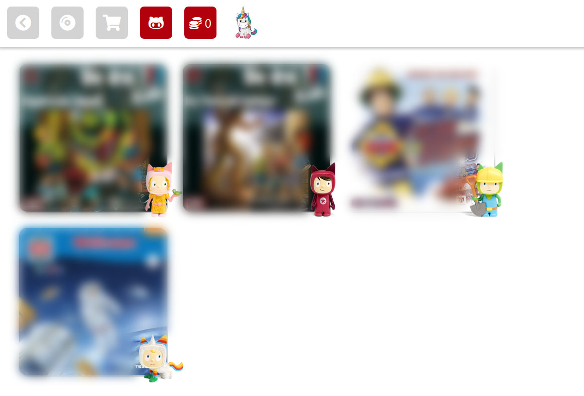

# TonieBox Creative Manager

- C# Api to access tonie cloud
- Web frontend to manage content of your creative tonies



## Setup

Create `.env` file

```
MYTONIE_LOGIN=
MYTONIE_PASSWORD=
MEDIA_LIBRARY=
HTTPS_PROXY=
```
- Use your toniecolud (https://meine.tonies.de) login in `MYTONIE_LOGIN` and `MYTONIE_PASSWORD`
- Set path in `MEDIA_LIBRARY` to your local media content
- `HTTPS_PROXY` is optional

## Run
```
docker-compose up
```
Open http://localhost:5995